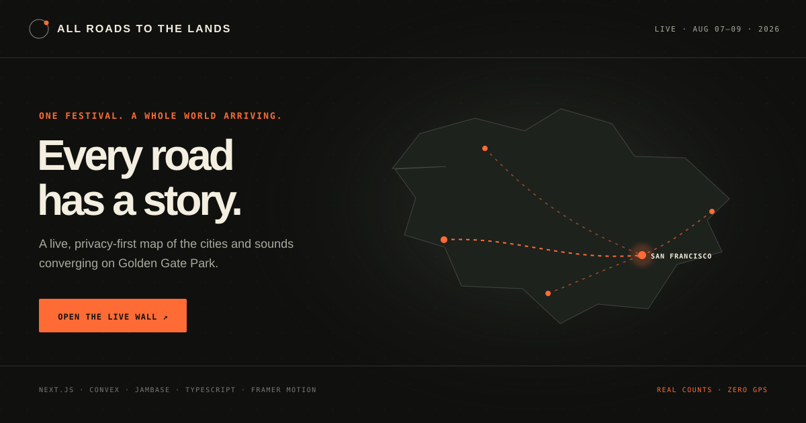

<div align="center">
  
  <h1>All Roads to the Lands</h1>
  <p><strong>One festival. A whole world arriving.</strong></p>
  <p>
    <a href="https://all-roads-to-lands.kaushik0788.chatgpt.site"><strong>Live wall</strong></a>
    ·
    <a href="https://all-roads-to-lands.kaushik0788.chatgpt.site/join"><strong>Cast a fan pick</strong></a>
    ·
    <a href="#quick-start"><strong>Run locally</strong></a>
  </p>
  <p>
    
    
    
    
    <a href="./LICENSE"></a>
  </p>
</div>

## About

All Roads to the Lands is a live, cinematic map of where Outside Lands attendees began their journey—and which 2026 artist they most want to see. A fan selects a city and artist, an illuminated route lands in San Francisco, the artist leaderboard moves, and every connected screen updates immediately.

It is built as a public, privacy-first festival experiment: no login, no GPS, no precise location, and no invented popularity numbers. Displayed rankings come from real anonymous submissions stored in Convex; JamBase supplies verified city, artist, event, and media metadata.

> **Unofficial community project.** Not affiliated with or endorsed by Outside Lands.

## Live experience

| Surface | What it does | Link |
| --- | --- | --- |
| Global wall | Animated routes, live city rankings, artist leaderboard, latest fan pick | [Open the wall ↗](https://all-roads-to-lands.kaushik0788.chatgpt.site) |
| Fan ballot | Two-step city and 2026 lineup selection designed for mobile and QR entry | [Add your journey ↗](https://all-roads-to-lands.kaushik0788.chatgpt.site/join) |

The wall is presentation-ready, but it is not a static mockup: Convex subscriptions update rankings and totals as submissions land.

## Why this exists

Festival apps tell you what is happening inside the gates. This project tells the human story outside them: thousands of individual journeys converging on one weekend in Golden Gate Park.

The interaction is intentionally immediate:

1. Scan the QR code on the wall.
2. Search for the city your trip began in.
3. Pick the 2026 lineup artist you cannot miss.
4. Submit once—no account, GPS, or precise location.
5. Watch your route and sound pick move the live wall.

## Design principles

- **The map is the hero.** Rankings support the global journey instead of turning the experience into a dashboard.
- **Two signals, one moment.** Every submission joins a route and an artist pick atomically.
- **Real means real.** Seed tasks import metadata with zero votes; they never manufacture leaderboard counts.
- **Venue-screen legibility.** Type, motion, contrast, and QR entry work from across a room as well as on a phone.
- **Graceful failure.** A presentation fallback keeps the composition intact while clearly identifying non-live data.

## Highlights

- **Live global wall** with animated city-to-San-Francisco routes
- **Atomic counters** for travelers, cities, countries, and collective distance
- **JamBase-native city search** using stable IDs, centroids, metro information, and event counts
- **Real concert media** from upcoming JamBase events, including compliant source links
- **Audience participation** through a dedicated mobile `/join` flow and QR code
- **Live sound pulse** with top-artist voting and the latest city-to-artist fan pick
- **Privacy by design** with an anonymous browser ID and no device location collection
- **Presentation fallback** that stays visually complete when backend services are unavailable
- **Python operations tool** for validating JamBase access and exporting city/media snapshots

## Architecture

```text
Mobile visitor                          Presentation wall
     │                                      │
     ├── city autocomplete ───────────────┐ │
     │                                    │ │ reactive query
     └── submit origin ────────┐          │ │
                               ▼          ▼ ▼
                         Convex backend
                    ┌──────────┴──────────┐
                    │ atomic submissions │
                    │ city aggregates    │
                    │ live subscriptions │
                    └──────────┬──────────┘
                               │ server-only actions
                               ▼
                          JamBase v3 API
                    cities · events · media
```

Convex serializes the change when a participant switches cities: the previous city's live count is decremented, the new city's count is incremented, and the submission is moved in one transaction. The wall receives the new aggregate through a reactive query.

## Technology

| Layer | Choice | Purpose |
| --- | --- | --- |
| Experience | Next.js API + React 19 | App Router application packaged for Workers with vinext |
| Language | TypeScript | Frontend and transactional backend |
| Live backend | Convex | Database, mutations, actions, subscriptions |
| Music data | JamBase Data API v3 | City identity, coordinates, events, images |
| Motion | Framer Motion + SVG | Route drawing, ranking movement, transitions |
| Operations | Python 3.12 | API verification and data snapshot tooling |

### Languages and repository map

| Language | Where it lives | Responsibility |
| --- | --- | --- |
| TypeScript / TSX | `app/`, `components/`, `convex/`, `lib/` | Product UI, realtime queries, transactions, and JamBase actions |
| CSS | `app/globals.css` | Responsive wall and mobile-ballot visual system |
| Python | `scripts/`, `tests/` | JamBase verification, normalization, snapshot tooling, and unit tests |
| SVG | `components/world-map.tsx`, `docs/` | Projected world map, route animation, and repository artwork |

The repository is TypeScript-first. GitHub calculates its language bar automatically from committed source; the table above explains how each language contributes to the product.

## Quick start

### 1. Install

```bash
git clone https://github.com/KaushikSiva/all-roads-to-lands.git
cd all-roads-to-lands
npm install
```

### 2. Connect Convex

```bash
npx convex dev
```

This writes `NEXT_PUBLIC_CONVEX_URL` to `.env.local` and generates the typed client bindings.

### 3. Add JamBase securely

Create or rotate a JamBase v3 key, then store it in Convex—not in browser environment variables:

```bash
npx convex env set JAMBASE_API_KEY your_rotated_key
```

JamBase v3 uses `Authorization: Bearer ...`. The application never sends the key to the browser.

### 4. Seed a presentation wall

For real JamBase city IDs and representative upcoming-event imagery:

```bash
npx convex run jambase:bootstrapDemo
npx convex run jambase:bootstrapArtists
```

If JamBase is temporarily unavailable, seed the coordinate-only fallback:

```bash
npx convex run wall:seedDemo
```

### 5. Run

```bash
npm run dev
```

Open [http://localhost:3000](http://localhost:3000) for the wall and [http://localhost:3000/join](http://localhost:3000/join) for the visitor flow.

## Environment variables

| Variable | Location | Required | Description |
| --- | --- | --- | --- |
| `NEXT_PUBLIC_CONVEX_URL` | `.env.local` / host | Production | Public Convex deployment URL |
| `JAMBASE_API_KEY` | Convex environment | Live search | Server-only JamBase v3 credential |

Copy `.env.example` for local documentation. Never commit `.env.local`.

## Python JamBase tool

The Python utility exercises the same city and event paths used by the Convex actions:

```bash
export JAMBASE_API_KEY=your_rotated_key
python3 scripts/jambase_sync.py --cities London Tokyo Chicago
python3 scripts/jambase_sync.py --cities Paris --country FR --output /tmp/paris.json
```

It normalizes city identifiers and centroids, then attaches the first upcoming event with usable JamBase media.

## Data model

### `cities`

Normalized JamBase metadata, coordinates, optional representative event media, and real submission counters. Displayed city totals come exclusively from live submissions. Indexed by stable JamBase city ID.

### `submissions`

One active origin and artist pick per anonymous participant ID. Indexed by participant and update time so the wall can highlight the newest arrival.

### `artists`

Normalized JamBase artist metadata plus real fan-pick counters. Presentation seeding imports metadata only; displayed artist totals come exclusively from live submissions. Indexed by stable JamBase artist ID.

## Privacy

- No GPS, IP geolocation, account, email, or precise location is collected.
- The visitor explicitly selects a city-level origin.
- The browser identifier only prevents accidental duplicate counting and lets someone change their answer.
- A production installation should add retention limits and abuse controls before operating at large public scale.

## JamBase attribution

City and live-event content is powered by JamBase. Event links are displayed without modification and include `rel="nofollow"`. Deployers are responsible for keeping attribution visible and complying with the current [JamBase attribution requirements](https://data.jambase.com/api/docs/attribution).

## Commands

```bash
npm run dev             # Next.js development server
npm run build           # Worker-compatible vinext production build
npm run build:next      # Reference Next.js production build
npm run lint            # ESLint
npm run typecheck       # TypeScript validation
npm run convex:dev      # Convex development sync
npm run convex:deploy   # Deploy Convex functions
npm run jambase:probe   # Python API smoke test
npm run test:python     # Python unit tests
```

## Deployment

1. Deploy Convex with `npx convex deploy`.
2. Add the returned production `NEXT_PUBLIC_CONVEX_URL` to the frontend host.
3. Set `JAMBASE_API_KEY` in the production Convex deployment.
4. Deploy Next.js through OpenAI Sites (the included `.openai/hosting.json` binds this repository to the site project) or another compatible platform.
5. Run `jambase:bootstrapDemo` against production if presentation data is desired.

The frontend contains a graceful presentation dataset, but real submissions require a configured Convex deployment.

## Roadmap

- Country-level arrival waves during festival weekend
- Moderated public messages attached to city routes
- Historical year-over-year festival reach
- Exportable community recap film
- Multi-festival configuration
- Organizer analytics with explicitly consented, aggregate-only data

## Contributing

Issues and focused pull requests are welcome. Please include screenshots or a short recording for visual changes and run the checks below before opening a PR:

```bash
npm run lint
npm run typecheck
npm run build
npm run test:python
```

## License

[MIT](LICENSE). Festival names and third-party media remain the property of their respective owners.

---

If this project makes the distance between people feel a little smaller, give it a star and bring another city onto the map.
